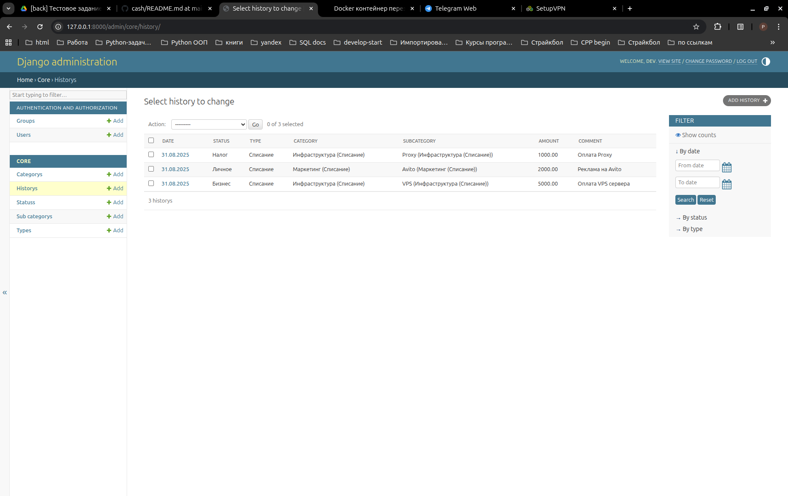

### Для запуска выполните следующее`
- Шаг 1
```bash
git clone git@github.com:adminfromKRSK24/cash.git
cd cash
```
- Шаг 2 
```
поместить файл .env в директорию cash # ссылка на файл архив .evn с ключами отправлена в следующем сообщении
```
- Шаг 3
```bash
docker compose up -d --build
```
http://127.0.0.1:8000/admin/

```
креды для доступа:
log: dev
pass: 123
```
### Доп.команды
```commandline

docker compose down --rmi all --volumes --remove-orphans
docker ps -a | grep history_web # Проверить состояние контейнера:
`docker logs history_web --tail 50` # Посмотреть логи контейнера, чтобы понять причину перезапуска:

```